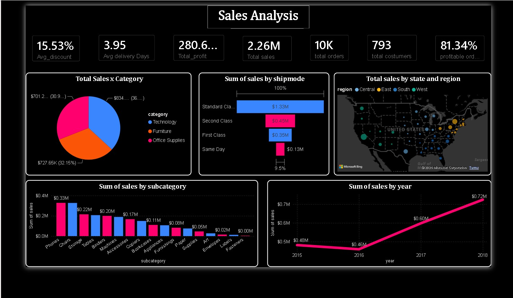

<div align="center">

# 📊 Power BI Sales Analysis Dashboard

### Transforming Sales Data into Actionable Business Insights



</div>

---

## 📌 Overview

This project is an interactive **Sales Analysis Dashboard built using Microsoft Power BI**.

The dashboard transforms raw sales data into meaningful business insights by analyzing:

- 💰 Sales & Profit Performance
- 📦 Product Categories & Sub-Categories
- 🚚 Shipping Modes
- 🌎 Regional & State-wise Sales
- 👥 Customer Base
- 📅 Year-wise Sales Trends
- 🏷️ Discounts
- ⏱️ Delivery Performance

The objective of this project is to demonstrate how raw business data can be transformed into a visually interactive dashboard that supports **data-driven decision making**.

---

## 🎯 Project Objectives

The main objectives of this project are:

- Analyze overall sales and profitability.
- Identify high-performing product categories.
- Understand sales distribution across regions and states.
- Analyze sales performance by shipping mode.
- Identify top-performing product sub-categories.
- Track sales growth over different years.
- Monitor average discounts and delivery time.
- Present important business KPIs in a single dashboard.

---

## 📂 Dataset

The project uses a sales dataset containing **9,994 order records**.

The dataset contains information related to:

| Data Area | Information |
|---|---|
| Orders | Order ID, Order Date, Ship Date |
| Customers | Customer ID, Customer Name, Segment |
| Geography | Country, City, State, Postal Code, Region |
| Products | Product ID, Product Name, Category, Sub-Category |
| Sales | Sales, Quantity |
| Discounts | Discount |
| Profit | Profit |
| Shipping | Ship Mode |

### Dataset Structure

The Excel workbook contains three sheets:

```text
Sample_Sales_data.xls
│
├── Orders
├── Returns
└── People
